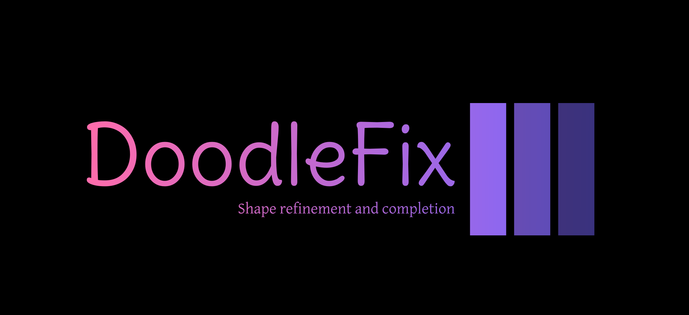

<a name="readme-top"></a>

<!-- PROJECT LOGO -->
<br />
<h1 align="center">DoodleFix: An Algorithms for refining shapes, analyzing symmetry and completing complex doodles.</h1>
<div align="center">
  <a href="https://github.com/yourusername/doodlefix">
    
  </a>
  <p>
    DoodleFix is your go-to tool for transforming distorted shapes into their closest geometric forms while ensuring symmetry in the refined shapes.
  <br />
    <br />
    <a href="https://youtu.be/your-demo-link">Watch the Demo</a>
    ·
    <a href="https://github.com/maskboyAvi/AdobeGensolve/issues">Report a Bug</a>
    ·
    <a href="https://github.com/maskboyAvi/AdobeGensolve/issues">Request a Feature</a>
  </p>
</div>

<!-- TABLE OF CONTENTS -->
<details>
  <summary><h2> Table of Contents </h2></summary>
  <ol>
    <li>
      <a href="#abouttheproject"> About The Project </a>
      <ul>
        <li><a href="#mission"> Mission </a></li>
        <li><a href="#valueproposition"> Value Proposition </a></li>
      </ul>
    </li>
    <li><a href="#keyfeatures">Key Features</a></li>
    <li><a href="#builtwith">Built With</a></li>
    <li><a href="#detection">Shape Classification and Transformation</a></li>
    <li>
      <a href="#gettingstarted">Getting Started</a>
      <ul>
        <li><a href="#installation">Installation Instructions</a></li>
        <li><a href="#example">Example Usage</a></li>
      </ul>
    </li>
    <li><a href="#clicommands">CLI Commands</a></li>
    <li><a href="#license">License</a></li>
    <li><a href="#contributing">Contributing</a></li>
    <li><a href="#team">Team Members</a></li>
  </ol>
</details>

<h2 id="abouttheproject"> About the Project </h2>

DoodleFix is a tool designed to handle distorted shapes by classifying them into their nearest geometric forms and transforming them accordingly. If a shape cannot be classified, it remains unchanged. For those that can be classified, DoodleFix refines them to their correct geometric forms and performs a symmetry check to ensure they adhere to geometric principles. It also checks if any two shapes overlap each other and transform them two distict shapes.

Check out our demo [here](https://youtu.be/your-demo-link).

<h3 id="mission"> Our Mission </h3>

Our mission is to empower users with a robust tool for transforming and analyzing distorted shapes, simplifying the process of working with imperfect or incomplete doodles while ensuring accurate geometric representation.

<h3 id="valueproposition"> Why Choose DoodleFix? </h3>

- **Shape Classification and Transformation:** Accurately classify distorted shapes and transform them into their proper representations.
- **Symmetry Analysis:** Ensure that transformed shapes adhere to geometric symmetry principles.
- **User-Friendly Interface:** Enjoy a seamless experience with an intuitive interface.
- **Advanced Algorithms:** Utilize cutting-edge machine learning models for high accuracy in shape classification and transformation.

<p align="right">(<a href="#readme-top">back to top</a>)</p>

<h2 id="keyfeatures"> Key Features </h2>

- **Distorted Shape Classification:** Identify if a distorted shape can be classified into a geometric form.
- **Geometric Transformation:** Convert classified shapes into their correct geometric representations.
- **Symmetry Check:** Analyze transformed shapes for symmetry in multiple directions.
- **Robust Performance:** Handle a diverse range of distorted shapes with impressive accuracy.

<p align="right">(<a href="#readme-top">back to top</a>)</p>

<h2 id="builtwith"> Built With </h2>

       
    

<h3> Open Source Pre-trained Models: </h3>

- [ResNet18](https://pytorch.org/vision/main/models/generated/torchvision.models.resnet18.html)
  
<p align="right">(<a href="#readme-top">back to top</a>)</p>

<h2 id="detection"> Shape Classification and Transformation </h2>

DoodleFix employs advanced machine learning models for shape classification, transformation, and symmetry checking.

### How It Works:

- **Shape Classification:** Our machine learning model classifies distorted shapes into geometric categories.
- **Geometric Transformation:** Once classified, shapes are transformed into their correct geometric forms.
- **Symmetry Check:** We analyze transformed shapes to ensure they exhibit geometric symmetry.

### Key Advantages:

- **High Accuracy:** Advanced models ensure precise classification and transformation.
- **Versatile Symmetry Analysis:** Check for symmetry in multiple directions, beyond just vertical and horizontal.

<p align="right">(<a href="#readme-top">back to top</a>)</p>

<h2 id="gettingstarted"> Getting Started </h2>

<h3 id="installation"> Installation Instructions </h3>

To set up DoodleFix on your local machine, follow these steps:

1. **Install Python 3.8 or higher:** [Download and install Python](https://www.python.org/downloads/) if you haven't already.

2. **Clone the repository:**

   ```bash
   git clone https://github.com/yourusername/doodlefix.git
   ```

3. **Navigate to the project directory:**

   ```bash
   cd doodlefix
   ```

4. **Install dependencies:**

   ```bash
   pip install -r requirements.txt
   ```

5. **Run the application:**

   ```bash
   python main.ipynb
   ```

For more detailed setup instructions, refer to our [documentation](docs/setup.md).

<h3 id="example"> Example Usage </h3>

To see DoodleFix in action, check out our demo or refer to the detailed example usage guide:

- **Demo:** [Watch the Demo](https://youtu.be/your-demo-link)
- **Example Usage Guide:** [Example Usage Guide](docs/examples/examples.md)

<p align="right">(<a href="#readme-top">back to top</a>)</p>

<h2 id="clicommands"> CLI Commands </h2>

DoodleFix provides a set of CLI commands for efficient interaction. Refer to the [documentation](docs/examples/examples.md) for usage examples.

```bash
classify : Classify a distorted shape into its closest geometric form
transform : Transform a classified shape into its proper geometric representation
check-symmetry : Check if the transformed shape adheres to symmetry principles
info : Get information about the application
```

<p align="right">(<a href="#readme-top">back to top</a>)</p>

<h2 id="license"> License </h2>

DoodleFix is licensed under the MIT license. For more information, please see the [LICENSE](LICENSE) file in the repository.

<p align="right">(<a href="#readme-top">back to top</a>)</p>

<h2 id="contributing"> Contributing </h2>

We welcome contributions! For detailed instructions on how to contribute, please refer to the [Contributing Guide](docs/contributing.md) in our documentation.

<p align="right">(<a href="#readme-top">back to top</a>)</p>

<h2 id="team"> Meet the Team </h2>

- [Aviral Katiyar](https://github.com/maskboyAvi)
- [Darsh Baxi](https://github.com/darshbaxi)
- [Asim](https://github.com/asim)

<p align="right">(<a href="#readme-top">back to top</a>)</p>

---
